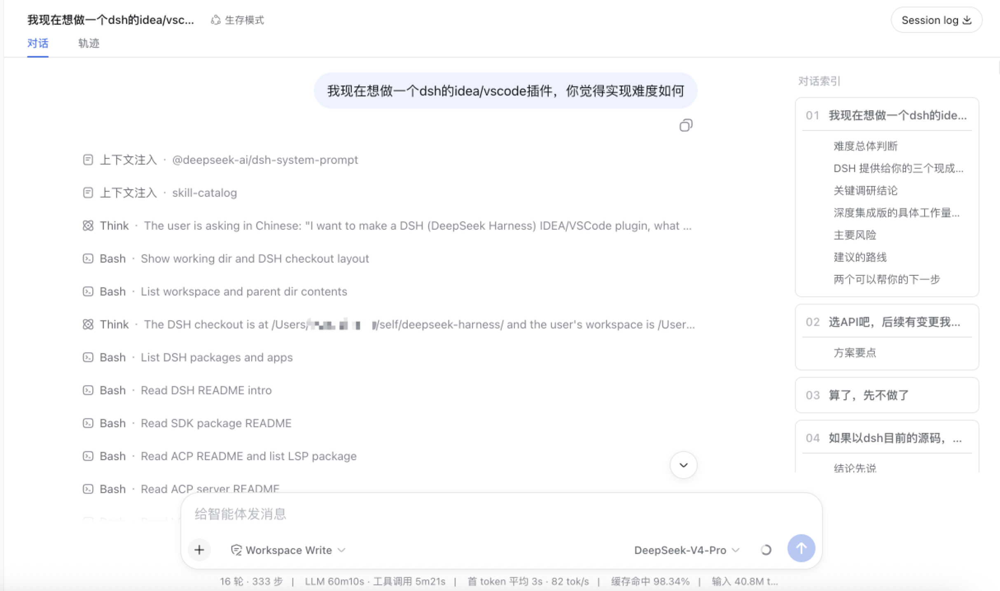

# ui-conversation-indexed

[English](README.md) | 中文

这是 DeepSeek Harness `ui-conversation` 的独立非官方修改版。它保留原有对话界面的完整功能，并增加用于定位对话轮次和 Markdown 标题的响应式右侧索引。

- 包名：`@aihesa/ui-conversation-indexed`
- 修改作者：[AiHeSa](https://github.com/AiHeSa)
- 上游仓库：[deepseek-ai/deepseek-harness](https://github.com/deepseek-ai/deepseek-harness)
- 上游包：`packages/client/ui-conversation`
- 基准版本：`99f6f02fecdb7dff40c3fbc9470f5907c29f74ca`
- 开源协议：[MIT](LICENSE)

本项目与 DeepSeek 无隶属关系，也未获得 DeepSeek 官方背书。

## 功能截图



## 修改内容

### 响应式对话索引

当对话容器宽度达到 `920px` 时，右侧会显示宽度为 `224px` 的 sticky 索引。页面会优先适度压缩对话正文；当正文已经无法保持可读宽度时，索引自动隐藏，正文恢复为占满空间的单列布局。

索引包含以下能力：

- 当前已经加载的每个对话轮次对应一张简约卡片；
- 卡片标题取自该轮开头的用户消息，并限制为最多 80 个字符；
- 如果该轮开头消息不在当前加载窗口，则使用本地化轮次编号兜底；
- 收录 Assistant 已渲染 Markdown 中的一级、二级、三级标题；
- 点击轮次或标题后直接滚动到对应位置；
- 遵守 `prefers-reduced-motion`，在减弱动画模式下取消平滑滚动；
- 定位后短暂高亮目标；
- 流式输出更新或向前加载历史记录时自动刷新索引；
- 索引内容可以独立滚动，但视觉上隐藏滚动条。

索引直接读取页面上已经渲染的语义 DOM，不会重新解析一遍 Markdown。因此 GFM、数学公式、流式输出和未来的 Markdown 行为仍以原渲染器为唯一实现。

### 缓存命中率显示

缓存命中率固定显示两位小数，并始终向下截取，不进行四舍五入：

- `90%` 显示为 `90.00%`；
- `1 / 3` 显示为 `33.33%`；
- `2 / 3` 显示为 `66.66%`。

实现使用 `BigInt` 整数运算，避免浮点数舍入误差。

### 重新回答已完成的答案

每个已完成的 Assistant 回答都会在“复制”按钮后显示“重新回答”按钮。点击后出现一个简约气泡，可以填写补充提问，也可以留空。

- 留空确认时，原样重新提交该轮开头的用户问题；
- 填写内容后确认时，会将去除首尾空白的补充内容追加到原问题中；
- 原问题包含图片时，会从当前会话重新读取并一同提交；
- 支持 `Ctrl+Enter` 或 `Command+Enter` 确认，支持 `Escape`、取消按钮和点击外部关闭；
- 提交失败时保留气泡和输入内容，并显示可重试错误。

重新回答会作为一个新的排队轮次提交，不会删除、修改或分支已有会话历史。

### 未修改的部分

原有会话骨架、聊天消息行、编辑器、队列、审批界面、详情面板、会话统计、工具 slot、插件 slot、流式输出和历史分页行为均保持不变。ConversationController 只增加了上述原问题重发路径。

索引不会：

- 索引尚未加载到页面的历史消息；
- 收录四级到六级标题；
- 增加搜索或持久化索引偏好；
- 替代应用级工具详情面板；
- 增加任何远端服务或服务端行为。

## 兼容机制

本仓库是 DeepSeek Harness 的工作区包，不是可以独立运行的完整应用。它应当放置在兼容的 DeepSeek Harness 源码树中的 `packages/client/ui-conversation-indexed` 路径。

源码包拥有独立名称 `@aihesa/ui-conversation-indexed`，但浏览器 bundle 会有意注册为原有运行时模块标识：

```text
@deepseek-ai/dsh-client-ui-conversation
```

这是因为 Harness 中已有的其他插件仍依赖原对话模块标识。Web bundle 使用依赖别名将原依赖替换成本包，同时一次只挂载一份对话实现。

## 环境要求

- 一份兼容的 DeepSeek Harness 源码；
- 上游项目要求的 Node.js 和 Corepack；
- 上游根 `package.json` 固定的 pnpm 版本；
- 本仓库位于 `packages/client/ui-conversation-indexed`。

当前版本基于 DeepSeek Harness revision `99f6f02fecdb7dff40c3fbc9470f5907c29f74ca`。上游仍处于开发者预览阶段，后续可能出现不兼容修改。

## 安装方法

以下命令均基于一份新的 DeepSeek Harness checkout。

### 1. 添加本仓库

推荐使用 Git submodule：

```bash
git submodule add https://github.com/AiHeSa/ui-conversation-indexed.git packages/client/ui-conversation-indexed
```

也可以直接 clone：

```bash
git clone https://github.com/AiHeSa/ui-conversation-indexed.git packages/client/ui-conversation-indexed
```

### 2. 注册工作区包

在 `tsconfig.base.json` 的 `paths` 中加入：

```json
{
  "compilerOptions": {
    "paths": {
      "@aihesa/ui-conversation-indexed": [
        "./packages/client/ui-conversation-indexed/src"
      ],
      "@aihesa/ui-conversation-indexed/*": [
        "./packages/client/ui-conversation-indexed/src/*"
      ]
    }
  }
}
```

在 `tsconfig.client.json` 的 `references` 中加入：

```json
{
  "references": [
    { "path": "./packages/client/ui-conversation-indexed" }
  ]
}
```

在 `apps/cli/package.json` 和 `packages/bundle/web-app/package.json` 中，都加入或替换为同一条原对话依赖的工作区别名：

```json
{
  "dependencies": {
    "@deepseek-ai/dsh-client-ui-conversation": "workspace:@aihesa/ui-conversation-indexed@^"
  }
}
```

保留原有 `ui-conversation` Loader 行，不要修改名称：

```yaml
- id: ui-conversation
  name: '@deepseek-ai/dsh-client-ui-conversation'
```

依赖别名会让该标识实际加载本修改版。不要再添加第二条对话 Loader 配置，否则会重复注册同一界面。

必须同时设置 CLI 的直接别名，因为 App Boot 会按“首次解析优先”构建扁平的安装依赖回退目录。如果只修改 `web-app`，另一个依赖上游对话包的 UI 包仍可能让 Loader 解析到原版 bundle。

### 3. 安装并构建

在 DeepSeek Harness 仓库根目录执行：

```bash
corepack pnpm install
corepack pnpm exec tsc -b packages/client/ui-conversation-indexed/tsconfig.json --force
corepack pnpm --filter @aihesa/ui-conversation-indexed run bundle
corepack pnpm run build:web
```

### 4. 启动 Web UI

```bash
corepack pnpm dsh web
```

打开 [http://127.0.0.1:3080/](http://127.0.0.1:3080/)。对话区域足够宽时，右侧索引会自动出现。

## 使用方法

1. 打开或创建一个对话。
2. 进行多轮对话，或者加载已有长对话。
3. Assistant 的 Markdown 内容中包含 `#`、`##` 或 `###` 标题时，这些标题会进入索引。
4. 把对话区域拉宽到响应式阈值以上。
5. 点击轮次卡片可以定位到对应对话，点击标题可以定位到回答中的对应章节。
6. 缩窄窗口或打开会占用空间的详情面板后，如果宽度不足，索引会自动隐藏。
7. 回答完成后，点击“复制”右侧的“重新回答”，按需输入补充内容并确认，即可提交一个新轮次。

该功能不需要增加设置、数据库迁移、API 修改或远端配置。

## 开发与验证

以下命令在父级 DeepSeek Harness 仓库根目录执行：

```bash
# Type-check this package
corepack pnpm exec tsc -p packages/client/ui-conversation-indexed/tsconfig.json --noEmit

# Run the package tests
corepack pnpm exec vitest run packages/client/ui-conversation-indexed/tests

# Build the browser plugin
corepack pnpm --filter @aihesa/ui-conversation-indexed run bundle
```

相关测试覆盖轮次卡片、一级到三级标题层级、四级标题排除、点击定位、响应式显示、目标标记、留空或带补充的重新回答、历史图片重发、键盘确认和失败反馈。

## 跟进上游更新

本包最初由上游 `packages/client/ui-conversation` 完整复制而来。同步上游时建议：

1. 记录新的上游 revision；
2. 对比上游 `ui-conversation` 与本包；
3. 将上游修复合并到本包；
4. 保留 `ConversationIndex.tsx`、对应 CSS、索引属性、本地化文案、响应式布局和测试；
5. 重新执行本包测试、客户端类型检查、bundle 构建和 Web 端到端测试；
6. 更新本文记录的基准 revision。

## 开源协议与署名

本项目使用 MIT License，并包含由 DeepSeek Harness 派生的代码：

- 原始代码版权：`Copyright (c) 2026 DeepSeek`；
- 修改内容版权：`Copyright (c) 2026 AiHeSa`。

完整协议见 [LICENSE](LICENSE)，上游署名和非官方声明见 [NOTICE.md](NOTICE.md)。第三方依赖仍分别适用其自身开源协议。

## 模型体验

无，因为本包不会注册隐藏提示词或工具；用户主动点击“重新回答”时，只会把所选轮次的原问题和用户填写的补充内容作为普通新轮次提交。

#### KV Cache 影响

对话索引和缓存命中率显示不会改变提供方请求。“重新回答”会重复原始提示内容，因此可能复用提供方的前缀缓存，但实际缓存行为仍由提供方决定；填写补充内容会改变重复请求的尾部。

## 已知限制与后续工作

- 只索引已经加载到消息流中的历史记录。
- 只收录 Assistant 已渲染的一级、二级、三级标题。
- 本包依赖外层 DeepSeek Harness 工作区，目前不是独立应用，也不是可以单独安装的 npm 插件。
- 兼容性以文中记录的上游基准 revision 为准；更新版本可能需要人工合并。
- 响应式阈值和索引宽度目前是 CSS 编译时常量，不是用户设置。
- 重新回答要求所选轮次开头的用户消息仍位于当前已加载的会话窗口中。
